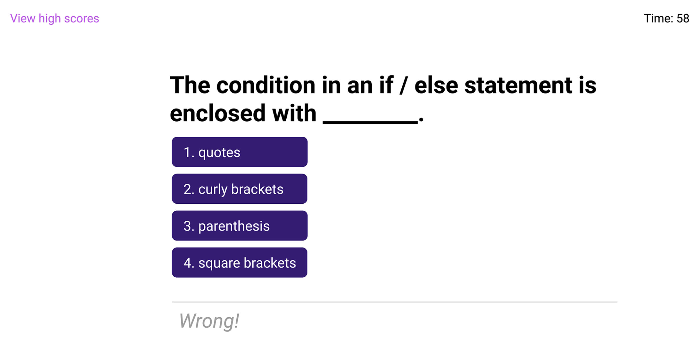

# Code-Quiz
Web APIs Challenge

This browser app features dynamically updated HTML and CSS powered by JavaScript. This application is a timed quiz on JavaScript fundamentals and displays high scores after quiz is complete. 

**Deployed Site: [Code-Quiz](https://armandosjunior.github.io/Professional-Portfolio/)**

---

### **Some Technical Features Include:**
```
- Timer once quiz has been initiated

- Color display of both correct & incorrect answers after user selects an answer

- Presentation of scores once quiz is complete or users timer runs out
```

---

### **Mock Up:**


---
### **Technologies Used:**
```
- Javascript
- CSS
- HTML
```
---

### **Direction for future development:**
```
- save initials and scores
- reduce timer if user selects incorrect answer
```
